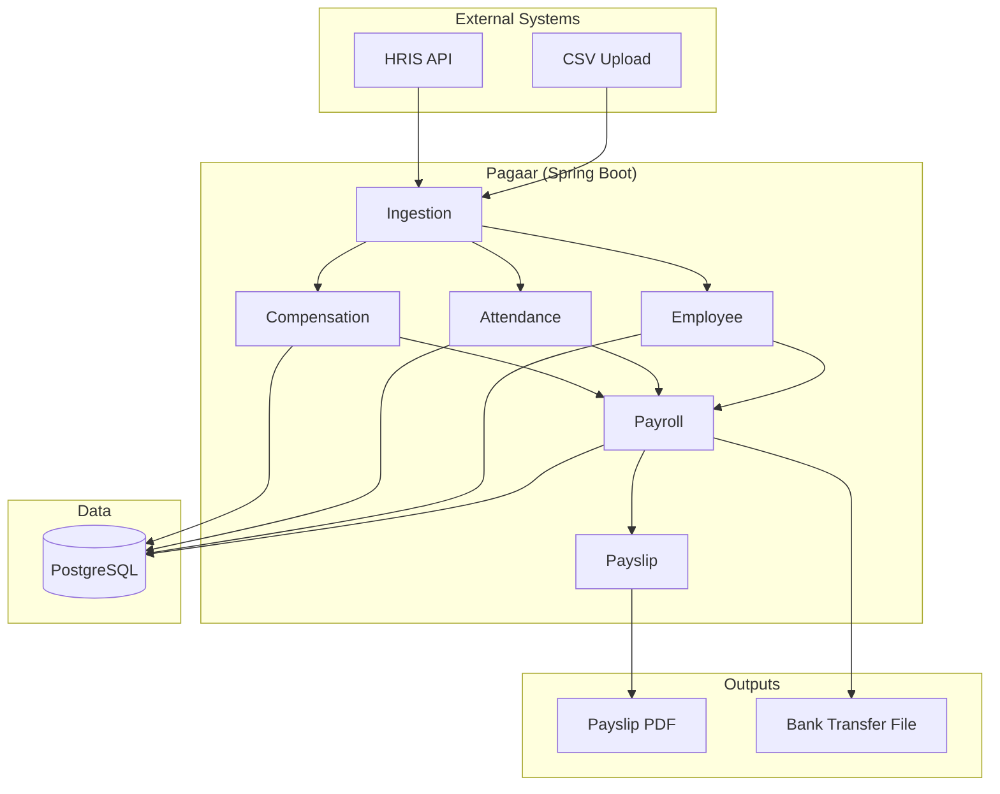

# 💰 Pagaar — Integration-First Payroll Engine

Integration-first payroll engine built using Spring Boot Modulith architecture supporting employee ingestion, attendance processing, effective-dated compensation structures, payroll calculations, payslip generation, and immutable payroll records.

[]()
[]()

---

## Scope

### V1 — Payroll Foundations

- Employee Management
- Attendance Management
- Payroll Run
- Payslip Generation
- Payroll Results

### V2 — Real Payroll Concepts

- Wage Types
- Compensation Structures
- Effective Dating
- Salary Revision Handling
- Payroll Result Line Items

### V3 — Enterprise Features

- CSV Ingestion
- Payroll Runs
- Auditability
- PF Calculation
- Professional Tax
- Bank Transfer File

---

## 🏗️ Architecture Overview

Designed as a Spring Boot modulith with explicit module boundaries and payroll-focused domain modeling.



---

## Engineering Highlights

- Effective-dated compensation modeling
- Immutable payroll results
- Payroll batch processing
- Financial auditability
- CSV ingestion pipelines
- Payslip generation
- Bank transfer file generation
- Domain-driven module boundaries
- Temporal data modeling
- Spring Boot Modulith architecture

---

## 🛠️ Tech Stack

- **Backend:** Java 21, Spring Boot, Spring Data JPA, Hibernate
- **Database:** PostgreSQL, Flyway
- **Document Generation:** OpenPDF / PDFBox
- **Infrastructure:** Docker, Nginx, GitHub Actions
- **Documentation:** OpenAPI / Swagger
- **Testing:** JUnit, Testcontainers

---

## Domain Model

### Employee

```text
Employee
- id
- employeeCode
- name
- department
- position
- createdAt
- updatedAt
```

### Attendance

```text
Attendance
- employeeId
- payrollPeriod
- workingDays
- paidDays
- lopDays
```

### Compensation History

```text
CompensationHistory
- id
- employeeId
- effectiveFrom
- effectiveTo
- createdAt
```

### Compensation Items

```text
CompensationItem
- id
- compensationHistoryId
- wageType
- amount
```
next: calculationType, value to be added.

### Wage Types

```text
- id
- code
- name
- category
```

### Payroll Run

```text
PayrollRun
- payrollPeriod
- status
```

### Payroll Result

```text
PayrollResult
- employeeId
- gross
- deductions
- net
```

---

## Timeline

### June

#### Spring Boot Foundations

- Project Setup
- Layered Architecture
- Flyway
- PostgreSQL
- Employee Module
- Attendance Module
- REST APIs
- Validation
- Exception Handling

#### Deliverable

```text
Create Employee
Record Attendance
View Attendance
```

---

### July

#### Payroll Engine

- Payroll Run Module
- Salary Proration
- Payroll Result
- Payslip PDF
- Payroll APIs

#### Deliverable

```text
Create Employee
      ↓
Record Attendance
      ↓
Run Payroll
      ↓
Generate Payslip
```

#### Concepts Learned

- Transactions
- Batch Processing
- Service Layer Design
- PDF Generation

---

### August

#### Compensation & Ingestion

- Compensation History
- Compensation Items
- Wage Types
- Effective Dating
- Salary Revision Handling

#### Ingestion

- Employee CSV
- Attendance CSV
- Compensation CSV

#### Deliverable

```text
Upload CSV
      ↓
Normalize Data
      ↓
Store History
      ↓
Run Payroll
```

#### Concepts Learned

- Temporal Modeling
- Data Import Pipelines
- Domain Modeling
- Payroll Calculations

---

### September

#### Enterprise Features

- Payroll Runs
- Immutable Payroll Results
- PF Calculation
- Professional Tax
- Bank Transfer File

#### Polish

- Swagger
- Docker
- Architecture Diagrams
- README
- Resume Bullets
- System Design Stories

#### Deliverable

```text
Upload Employee Data
        ↓
Upload Attendance
        ↓
Run Payroll
        ↓
Generate Payslip
        ↓
Generate Bank File
```

---

## Explicitly Out of Scope
        
To prevent scope creep:

### Not Building

- Retro Payroll
- Off-Cycle Payroll
- Income Tax Engine
- ESI
- NPS
- Gratuity
- Workflow Engine
- Rule Engine
- Kafka
- Redis
- Microservices
- Multi-Country Payroll
- RSUs
- Stock Vesting

These are future enhancements and intentionally excluded from V1.

---

## Learning Outcomes

Pagaar is designed to teach real-world backend engineering concepts:

- Spring Boot
- REST API Design
- PostgreSQL
- Flyway
- Transactions
- Effective Dating
- Financial Data Modeling
- Immutable Records
- Batch Processing
- File Generation
- Domain-Driven Design
- Integration Patterns

---

## Success Criteria

By September:

```text
Employee Ingestion
        ↓
Attendance Ingestion
        ↓
Payroll Processing
        ↓
Payslip Generation
        ↓
Bank File Generation
```

for a realistic employee dataset using a clean and maintainable Spring Boot architecture.

---

Built by Aman Kumar • Backend Engineering Portfolio Project